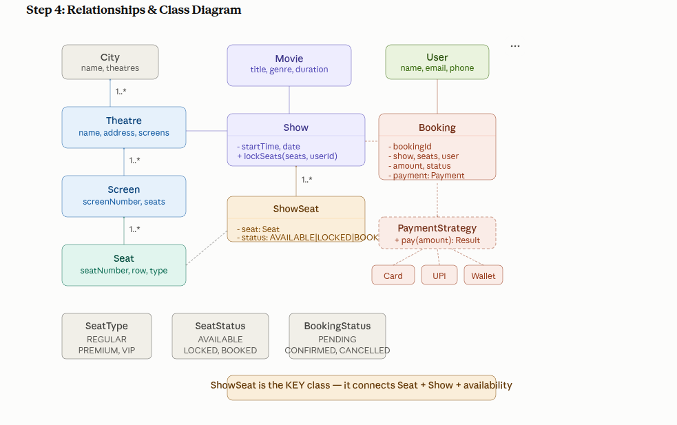

# LLD Problem #3: BookMyShow (Movie Ticket Booking)

This is a medium-difficulty low-level design problem commonly asked in interviews at companies like Amazon, Walmart, and Flipkart. It mainly tests:

- Concurrency handling
- Seat locking
- Payment integration
- Scalable object-oriented design

---

## 1. Clarify Requirements (3–5 min)

Before starting the design, clarify the expected behavior of the system.

| Your Question | Typical Answer |
|---|---|
| Multiple cities? | Yes, multi-city support |
| Multiple theatres per city? | Yes |
| Multiple screens per theatre? | Yes |
| Can a movie run on multiple screens? | Yes, at different show times |
| Seat types? | Regular, Premium, VIP with different pricing |
| What if 2 users try to book the same seat? | Only one should succeed |
| Payment methods? | Card, UPI, Wallet |
| Can users cancel bookings? | Yes, with refund |
| Search functionality? | Search by movie name, city, and genre |

### Final Requirements

- Support **multiple cities** and **multiple theatres**.
- Each theatre can have **multiple screens**.
- Each screen can run **multiple shows** at different times.
- Each show must maintain its own **seat map**.
- Seat states should be:
  - `Available`
  - `Locked`
  - `Booked`
- Users should be able to:
  - Search movies
  - Select a show
  - Choose seats
  - Make payment
  - Confirm booking
- The system must support **concurrent seat booking**, ensuring only one user can book the same seat.
- Support **multiple payment methods** using the **Strategy Pattern**.
- Allow **booking cancellation** and **refund flow**.

---

## 2. Noun Extraction → Classes

From the statement:

> A movie booking system has cities. Each city has theatres. Each theatre has screens. Each screen runs shows. Each show has seats with types (Regular, Premium, VIP). A user searches movies, selects a show, books seats, makes payment, and gets a booking confirmation.

### Identified Classes

| Category | Classes |
|---|---|
| Content | `Movie` |
| Location | `City`, `Theatre`, `Screen` |
| Showtime | `Show`, `ShowSeat` |
| Seat | `Seat`, `SeatType` (enum) |
| User Flow | `User`, `Booking`, `Payment` |
| Enums | `SeatType`, `BookingStatus`, `SeatStatus`, `PaymentMethod` |

---

## 3. Verb Extraction → Methods

Identify system behaviors and assign them to the right owner.

| Verb | Who has the data? | Method |
|---|---|---|
| Search movies | `MovieService` | `searchByCity(city): List<Movie>` |
| Get shows for a movie | `ShowService` | `getShows(movie, city): List<Show>` |
| Select seats | `Show` | `getAvailableSeats(): List<ShowSeat>` |
| Lock seats | `Show` | `lockSeats(seats, userId)` |
| Make payment | `PaymentStrategy` | `pay(amount): PaymentResult` |
| Confirm booking | `BookingService` | `confirmBooking(booking)` |
| Cancel booking | `BookingService` | `cancelBooking(bookingId)` |

---

## 4. Relationships & Class Diagram

---

## 5. Design Patterns Used

| Requirement | Trigger | Pattern |
|---|---|---|
| Pay via Card, UPI, or Wallet | Multiple algorithms for the same action | **Strategy Pattern** → `PaymentStrategy` |
| Notify user on booking confirmation | Event-based notification | **Observer Pattern** → `BookingObserver` |
| Only one booking system | Single shared instance | **Singleton Pattern** → `BookingService` |
| Theatre owns screens, screen owns seats | Parent-child ownership | **Composition** |
| Lock seats during payment | Concurrent access control | **Synchronized / Locking** |

---

## 6. Key Design Insight: `Seat` vs `ShowSeat`

This is one of the most important modeling decisions in the system.

### Why keep `ShowSeat` separate from `Seat`?

- `Seat` represents the **physical seat** in a screen.
  - Example: Row `A`, Seat `5`, Type `Premium`
  - This data does **not change** across shows.
- `ShowSeat` represents the **availability of that seat for a specific show**.
  - Example: Seat `A5` may be:
    - available for the **10:00 AM** show
    - booked for the **2:00 PM** show

### Why this separation matters

- Prevents one booking from blocking a seat across **all shows**.
- Keeps physical layout independent from show-specific availability.
- Makes the design more scalable and realistic.

> Without this separation, booking seat `A5` for one show would incorrectly block it for every show on that screen.

---

## 7. Code Implementation

The implementation should cover:

- Core entities and enums
- Seat state management
- Booking flow
- Seat locking logic
- Payment strategies
- Booking confirmation and cancellation

---

## 8. Follow-up Questions

| Follow-up | Answer |
|---|---|
| How to handle seat lock timeout? | Add a scheduled task that checks `lockTime`. If a seat remains locked for more than 10 minutes, call `release()`. `ScheduledExecutorService` can be used. |
| How to handle concurrent bookings? | Use `synchronized` in `lockSeats()` for in-memory design. In distributed systems, use Redis distributed locks or DB row-level locking. |
| How to add seat pricing per show? | Create a `ShowSeatPricing` class that maps `SeatType` to price per show. This allows different pricing for morning, afternoon, or weekend shows. |
| How to add offers/coupons? | Use the **Decorator Pattern** for price calculation or a separate **Strategy Pattern** for discount types like flat, percentage, or BOGO. |
| How to notify user on confirmation? | Use the **Observer Pattern**. A `BookingConfirmedEvent` can notify `EmailObserver`, `SMSObserver`, and `PushObserver`. |
| How to scale for millions of users? | Shard by city, use Redis for seat locking, Kafka for event processing, and separate read/write databases. |

---

## 9. SOLID Scorecard

| Principle | Applied Where |
|---|---|
| **SRP** | `Seat` handles physical layout, `ShowSeat` handles availability, `Show` manages showtime logic, and `BookingService` handles orchestration. |
| **OCP** | Adding a new payment method only requires a new strategy class. No change is needed in `BookingService`. |
| **LSP** | Any implementation of `PaymentStrategy` can be used wherever payment is required. |
| **DIP** | `BookingService` depends on the `PaymentStrategy` interface, not concrete implementations like `CardPayment`. |

### Key SOLID Insight

- `Seat` and `ShowSeat` are separated to prevent one booking from blocking the same seat across all shows.
